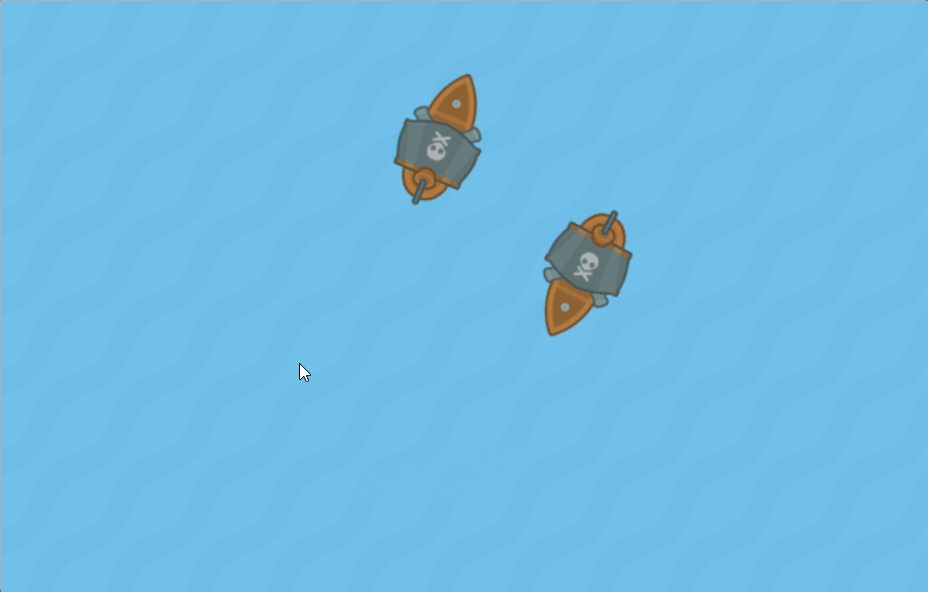

# A Beginner's Guide to Online Multiplayer

This repo contains the starter kit & materials for my [GlitchCon 2017](http://www.glitchcon.mn/) workshop on multiplayer games.  

This workshop will walk you through creating a simple top-down shooter with [Phaser.js](http://phaser.io/) as our game engine and [Socket.io](https://socket.io/) as our backend. If at any point you get stuck, each step has a link to a branch with that section completed so you can switch to that and keep following along. 



Art by [Kenny](https://kenney.nl/assets/pirate-pack).

## 0. Setup 

You should have [Node.js](https://nodejs.org/en/) installed. (You can alternatively follow along completely in your browser using [Glitch](https://glitch.com/) ). 

* Clone or [download](https://github.com/OmarShehata/glitchmultiplayer/archive/master.zip) this repository. 
* Extract it/navigate to the downloaded folder.
* Double click on `index.html` and/or open it in your favorite browser.

W or UP to move towards the mouse. Click to shoot. This is a basic functional single player game.  Your job is to implement the multiplayer part! 

Just to become familiar with the game's code, try your hand at some of these tasks:

* Make the world bigger (line 28)
* Make SPACE also thrust forward (line 51)
* Change your player ship type (line 126)
* Make the bullets move slower (line 152)

## 1. Detect & Spawn Players

Now we're going to setup Socket.io to detect connections and spawn players.

* Run `npm init` in your directory. 
* Run `npm install socket.io`. 
* Run `npm install express`.
* Create the file `index.js` (the default name) to be your server with the following boilerplate snippet:
```javascript
var express = require('express'); // Express contains some boilerplate to for routing and such
var app = express();
var http = require('http').Server(app);
var io = require('socket.io')(http); // Here's where we include socket.io as a node module 

// Serve the index page 
app.get("/", function (request, response) {
  response.sendFile(__dirname + '/index.html');
});

// Make static files available
app.use("/assets",express.static(__dirname + '/assets'));
app.use("/lib",express.static(__dirname + '/lib'));

// Listen on port 5000
app.set('port', (process.env.PORT || 5000));
http.listen(app.get('port'), function(){
  console.log('listening on port',app.get('port'));
});
```
* Test that this is working by running `node index.js` and then visiting `http://localhost:5000` to see if the game is running. 

Now to actually detect a connection, insert this code into the server we just created: 

```javascript
var players = {}; //Keeps a table of all players, the key is the socket id
// Tell Socket.io to start accepting connections
io.on('connection', function(socket){
	// Listen for a new player trying to connect
	socket.on('new-player',function(state){
		console.log("New player joined with state:",state);
		players[socket.id] = state;
		// Broadcast a signal to everyone containing the updated players list
		io.emit('update-players',players);
	})
})
```

Now we need to include and initialize Socket.io on the client as well. Add this include in `index.html`:

```html
<!-- Load the Socket.io networking library -->
<script src="/socket.io/socket.io.js"></script>
```

Now inside the `create` function, initialize the socket object:

```javascript
var socket = io(); // This triggers the 'connection' event on the server
socket.emit('new-player',{x:0,y:0,angle:0,type:1})
```

Now:

* Instead of sending 0's, make it send the actual player's position and rotation 
* Test it by running the server, then opening multiple windows with `localhost` and see if the server prints the correct positions.

We want the client to listen in on the `update-players` event and create a ship in the right spot for each player:

```javascript
// Listen for other players connecting
socket.on('update-players',function(players_data){
    var players_found = {};
    // Loop over all the player data received
    for(var id in players_data){
        // If the player hasn't been created yet
        if(other_players[id] == undefined && id != socket.id){ // Make sure you don't create yourself
            var data = players_data[id];
            var p = CreateShip(data.type,data.x,data.y,data.angle);
            other_players[id] = p;
            console.log("Created new player at (" + data.x + ", " + data.y + ")");
        }
        players_found[id] = true;
    }
    // Check if a player is missing and delete them 
    for(var id in other_players){
        if(!players_found[id]){
            other_players[id].destroy();
            delete other_players[id];
        }
    }
})
```

* Make sure you define the table `other_players` at the top of your code to keep track of the other ships. 
* Test this out! You should see new ships being created on screen whenever anyone connects.

**Problem: Notice that if someone disconnects, they'll still be on screen.**

To fix that, we simply need to listen for a `disconnect` event on the server, delete that id from our table and emit a new `update-players` event. 

You can see a functional implementation of that on the [step1](https://github.com/OmarShehata/glitchmultiplayer/tree/step1) branch.

## 1.5 (Optional) Ngrok Setup

If you want to expose your localhost to the outside world, so other people around you can join your game session, the `ngrok` package is an easy way to do that.

* Run `npm install ngrok -g` 
* Run your localhost in a seperate terminal (`node index.js`)
* Run `ngrok http 5000` to get a public URL to that local port

Try sharing that link with someone (or opening it on your phone) !

## 2. Sync Positions

This is where it gets interesting. We want to update players so we can see them moving in real time.

Your task is to:

* Make client `emit` when they've moved.
* Make client listen for move events and update the players on screen.
* Make server broadcast any move event it receives to all other players.

This is one straightforward way to sync a multiplayer game; send the state to everyone every time it changes. 

**Try doing this on your own**. The solution is implemented on the [step2](https://github.com/OmarShehata/glitchmultiplayer/tree/step2) branch.

## 3. Sync Bullets

A different way of syncing objects is by having the _server_ be in charge of the simulation and just instruct the clients where to render things. This is more work on the server, but is more cheat-proof. The general idea is:

* Clients `emit` when they fire a bullet 
* Server simulates all the bullet motion 
* Server broadcasts the position of every bullet to everyone 

### 3. a. Install `node-gameloop`

This is a handy package for running a gameloop on the server. Do:

* `npm install node-gameloop`
* Include it in the server code:

```javascript
var gameloop = require('node-gameloop'); // Gameloop helps us to run some game logic on the server 
```

* Set up the game loop at the bottom of the server code:

```javascript
var fps = 60;
gameloop.setGameLoop(function(delta) {
	// This will run at 60 fps 
	
}, 1000 / fps);
```

### 3. b. Simulate Bullets on Server

* Create a bullet array
* Listen in on bullets being shot:

```javascript
// Listen in on bullets being shot 
socket.on('bullet-shot',function(bullet_state){
	// bullet_state should be an object like {x:[Number],y:[Number],speed_x:[Number],speed_y:[Number]}
	bullet_array.push(bullet_state);
})
```

* Copy over the the bullet update code from the client. Your game loop should look something like this:

```javascript
var fps = 60;
gameloop.setGameLoop(function(delta) {
	// This will run at 60 fps 
	for(var i=0;i<bullet_array.length;i++){
        var bullet = bullet_array[i];
        bullet.x += bullet.speed_x; // Notice it's no longer bullet.sprite.x 
        bullet.y += bullet.speed_y; 
        // Remove if it goes too far off screen 
        if(bullet.x < -10 || bullet.x > 2000 || bullet.y < -10 || bullet.y > 2000){
            bullet_array.splice(i,1);
            // "Destroying" a bullet now is just a matter of removing it from the array 
            // The client is responsible for handling the actual sprites 
            i--;
        }
    } 

}, 1000 / fps);
```

* Emit the bullet array to everyone **in your game loop**:

```javascript
io.emit('bullet-update',bullet_array);
```

And that's it for the server!

### 3. c. Render Bullets on Client 

* Tell the server every time we shoot, but **do NOT** actually create the sprite yet. So our shoot code looks like:

```javascript
// Shoot bullet 
if(game.input.activePointer.leftButton.isDown && !this.shot){
	var speed_x = Math.cos(this.sprite.rotation + Math.PI/2) * 20;
	var speed_y = Math.sin(this.sprite.rotation + Math.PI/2) * 20;
	socket.emit('bullet-shot',{x:this.sprite.x,y:this.sprite.y,speed_x:speed_x,speed_y:speed_y})
	this.shot = true;
}
```

* Delete the bullet update block inside the `GameLoop` function since that's happening on the server now. 
* Listen for bullet updates and render the bullets:

```javascript
// Listen for bullet updates 
socket.on('bullet-update',function(bullets){
    // If there's not enough bullets on the client, create them
    for(var i=0;i<bullets.length;i++){
	if(bullet_array[i] == undefined){
	    bullet_array[i] = game.add.sprite(bullets[i].x,bullets[i].y,'bullet');
	} else {
	    //Otherwise, just update it! 
	    bullet_array[i].x = bullets[i].x; 
	    bullet_array[i].x = bullets[i].y;
	}
    }
    // Otherwise if there's too many, delete the extra 
    for(var i=bullets.length;i<bullet_array.length;i++){
	bullet_array[i].destroy();
	bullet_array.splice(i,1);
	i--;
    }

})
```

Now test it out! **There should be a bug in there. Can you fix it? **

The complete implementation of this step is on the [step3](https://github.com/OmarShehata/glitchmultiplayer/tree/step3). 

## Bonus: Unique Ship Types

TODO: Describe making the server give each ship a unique ship type. 

## Bonus: Intepolate Positions 

In an ideal world, you'll have a constant stream of position updates and all your ships will look smooth. But we need to account for lag. One way to do that is to interpolate positions of the ships in between the time it takes to get another update. 

**Try doing this on your own**. The solution is implemented in the [bonus-interpolate-positions](https://github.com/OmarShehata/glitchmultiplayer/tree/bonus-interpolate-positions) branch. 

## Bonus: Simulate Bullet on Client 

TODO: To reduce the amount of data we're sending, we can simulate the bullet visually on the client. 

